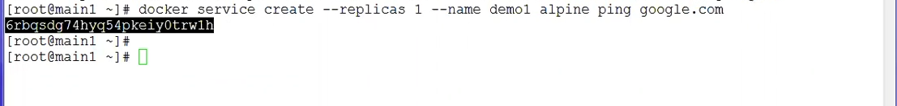

<h1 align="center">
  <br>
  <a href="https://www.docker.com"></a>
  <br>
  Docker
  <br>
</h1>


## 🚩 Table of Contents

- [Docker basic commands](#docker-basic-commands)
- [Create image](#create-image)
- [Networking Exposing Container Ports](#networking-exposing-container-ports)
- [Networking Access Container](#networking-access-container)
- [Networking linking containers](#networking-linking-containers)
- [Docker Swarm Architecture](#docker-swarm-architecture)
  - [Create Swarm manager](#create-swarm-manager)
  - [Join Node to Cluster](#join-node-to-cluster)
  - [Swarm deploy and inspect service](#swarm-deploy-and-inspect-service)
  - [Delete service run on swarm](#delete-service-run-on-swarm)
  - [Swarm Drain](#swarm-drain)

# Docker basic commands

* docker pull
* docker run
* docker run -d —name container-name -p <host-port>:<container-port> image-name:<version>
* docker exec -it
* docker ps
* docker ps -a/-all
* docker port container-name
* docker rm container-name   
* docker run -it --name container-name ubuntu:latest


# Create image

* `docker commit [OPTIONS] CONTAINER [REPOSITORY[:TAG]]` Create a new image from a container’s changes.
* `docker push [OPTIONS] NAME[:TAG]` Push an image or a repository to a registry.
* `docker rmi [OPTIONS] IMAGE [IMAGE...]` Remove one or more images.


### Example
```console
$ docker ps

CONTAINER ID        IMAGE               COMMAND             CREATED             STATUS              PORTS              NAMES
c3f279d17e0a        ubuntu:12.04        /bin/bash           7 days ago          Up 25 hours                            desperate_dubinsky
197387f1b436        ubuntu:12.04        /bin/bash           7 days ago          Up 25 hours                            focused_hamilton

$ docker commit c3f279d17e0a  svendowideit/testimage:version3

f5283438590d

$ docker images

REPOSITORY                        TAG                 ID                  CREATED             SIZE
svendowideit/testimage            version3            f5283438590d        16 seconds ago      335.7 MB

$ docker push svendowideit/testimage:version3

# Remove local image
$ docker rmi svendowideit/testimage:version3

# Pull custom image
docker run -it —name testimage1 svendowideit/testimage:version3
```

# Networking Exposing Container Ports

* `iptables -L > file-name` Save ip rule to file
* `docker run -it --name CONTAINER -p HOST-PORT:CONTAINER-PORT IMAGE[:TAG] /bin/bash` This binds port of the container to port of the host machine.

**1. On host machine**
```console
$ iptables -L

Chain INPUT (policy ACCEPT)
target     prot opt source               destination         

Chain FORWARD (policy DROP)
target     prot opt source               destination         
DOCKER-USER  all  --  anywhere             anywhere            
DOCKER-ISOLATION-STAGE-1  all  --  anywhere             anywhere            
ACCEPT     all  --  anywhere             anywhere             ctstate RELATED,ESTABLISHED
DOCKER     all  --  anywhere             anywhere            
ACCEPT     all  --  anywhere             anywhere            
...


# Save ip rule to file name before
$ iptables -L > before

# This binds port `22` of the container to port `2222` on `127.0.0.1` of the host machine.
$ docker run -it --name node1 -p 2222:22 ubuntu bash
```

**2. In docker container**
```
# Install some important utils
$ apt-get update
$ apt-get install net-tools
$ apt-get install iproute2
$ apt-get install iputils-ping
$ apt-get install openssh-server
$ apt-get install vim

$ ip r l
172.17.0.0/16 dev eth0 proto kernel scope link src 172.17.0.2

$ /etc/init.d/ssh start
 * Starting OpenBSD Secure Shell server sshd                               [ OK ]

$ /etc/init.d/ssh status
 * sshd is running

# Change "PermitRootLogin" from `prohibit-password` to `yes`
$ vim /ect/ssh/sshd_config

$ /etc/init.d/ssh restart
 * Restarting OpenBSD Secure Shell server sshd                             [ OK ]

# Set root password for container
$ passwd
```

**3. On host machine**
```console
$ iptables -L > after

# Login to container on port 222
$ ssh -p 2222 root@172.17.0.1
```

# Networking Access Container
**Default network** - When you install Docker, it creates three network automatically.

```console
$ docker network ls

NETWORK ID          NAME                         DRIVER              SCOPE
aac767fa1948        bridge                       bridge              local
c1ae18c709ad        host                         host                local
1534b88b50df        none                         null                local
```

**Default network** - The `bridge network` represents the `docker0` network present in all Docker installation. To change the network run below command.

```console
$ docker run --network=<NETWORK>
```

#### Example

* `docker run -it -d --netowrk=NETWORK --name CONTAINER -p HOST-PORT:CONTAINER-PORT IMAGE[:TAG] /bin/bash` This command will not allow docker to access host network
* `brctl show` show bridge network

**On host machine**
```console
$ docker run -it -d --network=none --name node6 ubuntu:latest /bin/bash
```

**In docker container**
```console
$apt-get update
Err:1 http://security.ubuntu.com/ubuntu bionic-security InRelease  Temporary failure resolving 'security.ubuntu.com'
Err:2 http://archive.ubuntu.com/ubuntu bionic InRelease  Temporary failure resolving 'archive.ubuntu.com'
Err:3 http://archive.ubuntu.com/ubuntu bionic-updates InRelease  Temporary failure resolving 'archive.ubuntu.com'
Err:4 http://archive.ubuntu.com/ubuntu bionic-backports InRelease  Temporary failure resolving 'archive.ubuntu.com'
Reading package lists... Done        
W: Failed to fetch http://archive.ubuntu.com/ubuntu/dists/bionic/InRelease  Temporary failure resolving 'archive.ubuntu.com'
W: Failed to fetch http://archive.ubuntu.com/ubuntu/dists/bionic-updates/InRelease  Temporary failure resolving 'archive.ubuntu.com'
W: Failed to fetch http://archive.ubuntu.com/ubuntu/dists/bionic-backports/InRelease  Temporary failure resolving 'archive.ubuntu.com'
W: Failed to fetch http://security.ubuntu.com/ubuntu/dists/bionic-security/InRelease  Temporary failure resolving 'security.ubuntu.com'
W: Some index files failed to download. They have been ignored, or old ones used instead.
```

**On host machine**
```console
# show bridge network
$ brctl show

bridge name	      bridge id		      STP enabled	 interfaces
br-1529dd590845		8000.0242e45e44de	no		
br-88a4e82e5e82		8000.02427e7848a9	no		       veth13dc0e2
							                                 veth5b6b2dd
		                                                     vethc80cad5
docker0		        8000.0242456b2791	no		       veth39cedaf

$ docker exec -it node1 /bin/bash
```

**In docker container**
```console
$ ifconfig

eth0: flags=4163<UP,BROADCAST,RUNNING,MULTICAST>  mtu 1500
        inet 172.17.0.2  netmask 255.255.0.0  broadcast 172.17.255.255
        ether 02:42:ac:11:00:02  txqueuelen 0  (Ethernet)
        RX packets 106  bytes 15281 (15.2 KB)
        RX errors 0  dropped 0  overruns 0  frame 0
        TX packets 51  bytes 10286 (10.2 KB)
        TX errors 0  dropped 0 overruns 0  carrier 0  collisions 0

lo: flags=73<UP,LOOPBACK,RUNNING>  mtu 65536
        inet 127.0.0.1  netmask 255.0.0.0
        loop  txqueuelen 1000  (Local Loopback)
        RX packets 0  bytes 0 (0.0 B)
        RX errors 0  dropped 0  overruns 0  frame 0
        TX packets 0  bytes 0 (0.0 B)
        TX errors 0  dropped 0 overruns 0  carrier 0  collisions 0
```

These interfaces naming different but they are attach to each other


**Network access:**
1. docker container
2. docker0 bridge
3. VM enp0s3
4. Host network

When container `network=none`, so that container's interfaces will not show image bridge network on host machine.


# Networking linking containers

How two container can communicate with each other.
* `docker run -it --link SOURCE-CONTAINER[:ALIAS/OPTION-NAME] --name NEW-CONTAINER IMAGE[:TAG]` create another container in link mode

### Example

**First containers**
```console
# Pull redis image
$ docker pull redis

# Create new redis container from redis image, it will start in post 6379/tcp
$ docker run -d --name redis1 redis

$ docker ps
CONTAINER ID    IMAGE    COMMAND                  CREATED             STATUS              PORTS                                                                       NAMES
8c93dca13ae7    redis    "docker-entrypoint.s…"   6 seconds ago       Up 5 seconds        6379/tcp                                                                    redis1
```

**Second container**
```console
# create busybox container then link to redis1
$ docker run -it --link redis1:redis --name redisclient1 busybox
```

**In Busybox container**
```console
/ #  cat /etc/hosts
127.0.0.1	localhost
::1	localhost ip6-localhost ip6-loopback
fe00::0	ip6-localnet
ff00::0	ip6-mcastprefix
ff02::1	ip6-allnodes
ff02::2	ip6-allrouters
172.17.0.3	redis 8c93dca13ae7 redis1 #IP-Adress of Source Container
172.17.0.4	9d2a242d644a

/ # set | grep -i redis
REDIS_ENV_GOSU_VERSION='1.10'
REDIS_ENV_REDIS_DOWNLOAD_SHA='1db67435a704f8d18aec9b9637b373c34aa233d65b6e174bdac4c1b161f38ca4'
REDIS_ENV_REDIS_DOWNLOAD_URL='http://download.redis.io/releases/redis-4.0.10.tar.gz'
REDIS_ENV_REDIS_VERSION='4.0.10'
REDIS_NAME='/redisclient1/redis'
REDIS_PORT='tcp://172.17.0.3:6379'
REDIS_PORT_6379_TCP='tcp://172.17.0.3:6379'
REDIS_PORT_6379_TCP_ADDR='172.17.0.3'
REDIS_PORT_6379_TCP_PORT='6379'
REDIS_PORT_6379_TCP_PROTO='tcp'
_='redis'

/ # ping redis
PING redis (172.17.0.3): 56 data bytes
64 bytes from 172.17.0.3: seq=0 ttl=64 time=0.096 ms
64 bytes from 172.17.0.3: seq=1 ttl=64 time=0.057 ms
64 bytes from 172.17.0.3: seq=2 ttl=64 time=0.124 ms
64 bytes from 172.17.0.3: seq=3 ttl=64 time=0.145 ms

--- redis ping statistics ---
4 packets transmitted, 4 packets received, 0% packet loss
round-trip min/avg/max = 0.057/0.105/0.145 ms
```


--------
# Docker Swarm Architecture


### Example:

- Create one swarm manager and three swarm nodes


- Install docker and check the docker daemon status


### Create Swarm manager
```console
$ docker swarm init --advertise-addr 192.168.56.102
```


```console
# Check manager status
$ docker info
```


```console
# List nodes
$ docker node ls
```


### Join Node to Cluster

**1. On swarm manager**
```console
# This command means to add worker in to swarm mananger
$ docker swarm join-token worker
```


**2. On swarm node**
- Use provided command by swarm manager display in console > apply it to swarm node


**3. On swam manager**
```console
# List nodes
$ docker node ls
```

There is one mananger and three worker joined in the cluster

**4. On swarm node**
```console
# To leave from cluster
$ docker swarm leave
```

**5. On swam manager** : checking swarm node


# Swarm deploy and inspect service

* `docker service create --replicas AMOUNT --name SERVICE-NAME IMAGE[:TAG] EXEC-COMMAND`
* `docker service scale SERVICE-NAME=AMOUNT`

**On swam manager**
```console
# This will run only one instance and pinging to google.com
$ docker service create --replicas 1 --name demo1 alpine ping google.com
```


```console
# List docker services
$ docker service ls
```


```console
# Check instance information
$ docker service inspect --pretty demo1
```


```console
# Check service running or not and on which node
$ docker service ps demo1
```


```console
# Scale demo1 instance to 5 replicas
$ docker service scale demo1=5
demo1 scaled to 5

$ docker service ps demo1
```


Total 5:
- main1 x 1
- worker1 x 1
- worker2 x 1
- worker3 x 2


# Delete service run on swarm

**On swam manager**
* `docker service rm SERVICE-NAME` remove from manager will also remove from swarm node

```console
# Remove demo1 instance
$ docker service rm demo1
```


# Swarm Drain
- Put node to maintainent mode

**On swam manager**
* `docker node update --availability drain NODE-NAME`

```console
# Put worker3 into maintainent mode
$ docker node update --availability drain worker3
```


## 🔖 Full Docker references & Cheat Sheet
- docker docs reference: https://docs.docker.com/
- docker cheat sheet: https://www.docker.com/sites/default/files/Docker_CheatSheet_08.09.2016_0.pdf

## 💬 Contributing

Your contributions are always welcome! :tada:

1. Fork it!
2. Create your feature branch: `git checkout -b my-new-feature`
3. Commit your changes: `git commit -am 'Add some feature'`
4. Push to the branch: `git push origin my-new-feature`
5. Submit a pull request :D

## 📜 License

The MIT License (MIT) 2018
> GitHub [@yinkokpheng](https://github.com/yinkokpheng)
